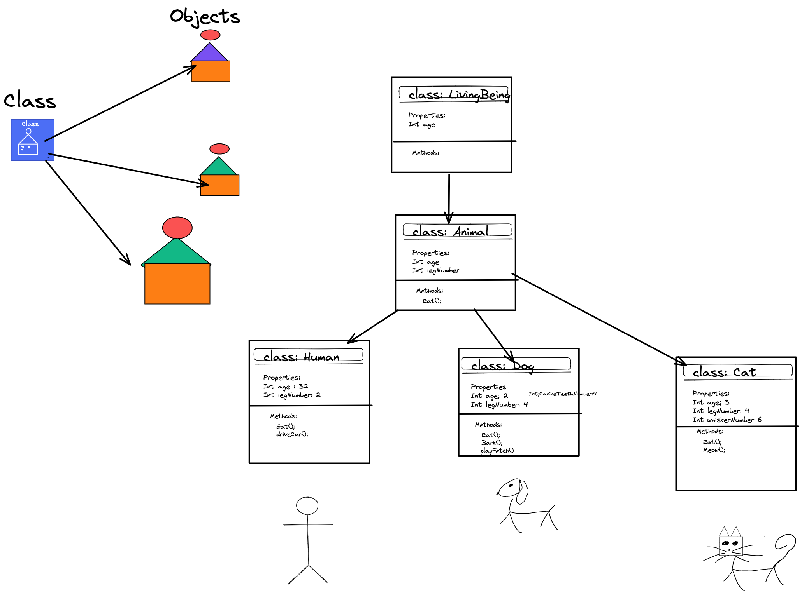

# Object Oriented Programming 
Modular Software developlment using Classes to construct objects which contain data in the form of properties (fields).


## 4 Elements of OOP
 - #### Abstraction 
	-  Modeling the relevant attributes and interactions of entities as classes to define an abstract representation of a system.
- #### Encaplsulation
	- Hiding the internal state and functionality of an object and only allowing access through a public set of functions.
- #### Inheritance 
	- Ability to create new abstractions based on existing abstractions.
 - #### Polymorphism
	- Ability to implement inherited properties or methods in different ways across multiple abstractions.


*Enable GitHub Pages*

# MonoBehaviour

[Monobehavior](https://docs.unity3d.com/ScriptReference/MonoBehaviour.html) is the base class from which every Unity script derives.
```c#
//Using Directives
using System.Collections;
using System.Collections.Generic;
using UnityEngine;

// Inherits from Monobehaviour 
public class BasicMonoBehaviorScript : MonoBehaviour
{


    // Start is called before the first frame update
    void Start()
    {
        
    }

    // Update is called once per frame 
  void Update()
    {
        
    }
}
```


# Enums
An [ Enum](https://learn.microsoft.com/en-us/dotnet/csharp/language-reference/builtin-types/enum) is a special "class" that represents a group of **constants** (unchangeable/read-only variables).

```c#

//Enum Example
public enum EnemyType
{
    Melee,
    Exploder,
    Shooter,
    MachineGun,   
    
}
```

# Parameters
Parameters are data that is passed into a method. Within The method a paramter is treated as a variable.

# Constructors
A [constructor](https://learn.microsoft.com/en-us/dotnet/csharp/programming-guide/classes-and-structs/constructors)  is a special method  that is used to initialize objects. The advantage of a constructor, is that it is called when an object of a class is created. It can be used to set initial values for fields:


```c# 
using UnityEngine;
public class Weapon
{
    private string name;
    private float damage;

//Constructor with two parameters
    public Weapon(string _name, float _damage)
    {
        name = _name;
        damage = _damage;
    }
//Override Constructor with no parameters
    public Weapon() { }

    public void Shoot()
    {
        Debug.Log($"Shooting from the Gun");
    }
}
```
# Access Modifiers
 [Access Modifier](https://learn.microsoft.com/en-us/dotnet/csharp/programming-guide/classes-and-structs/access-modifiers) controls rhe accessibility level of your code. These can be used to make accesable or inaccasible variable or methods. 
 There are multiple types of access modifies but for now we will be using the following two:
	 
- [public](https://learn.microsoft.com/en-us/dotnet/csharp/language-reference/keywords/public): The type or member can be accessed by any other code in the same assembly or another assembly that references it. The accessibility level of public members of a type is controlled by the accessibility level of the type itself.
- [private](https://learn.microsoft.com/en-us/dotnet/csharp/language-reference/keywords/private): The type or member can be accessed only by code in the same `class` or `struct`.


