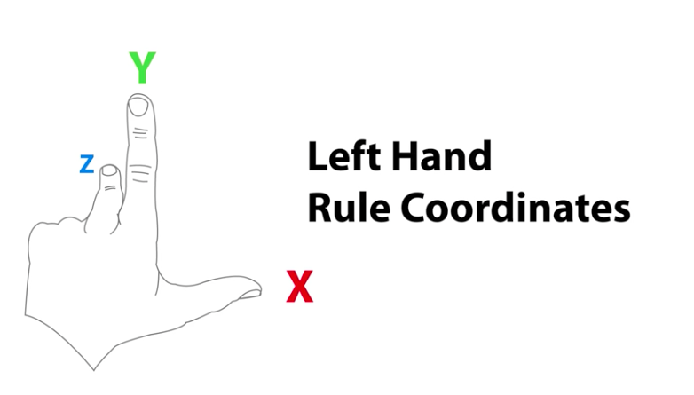

##### Previous Lesson
[Module2 Lesson3](Module2%20Lesson3.md)

# Scalars and Vectors

##### Vector
Vectors are quantities that are fully described by both a magnitude and a direction.
##### Scalar
 Scalars are quantities that are fully described by a magnitude (or numerical value) alone.

# Trigonometry

##### Sine
Give. (The Y Value on the Unit Circle!)
##### Cosine
cosine of an angle t equals the x-value of the endpoint
##### Tangent
The tangent of an angle is equal to the y-coordinate divided by the x-coordinate

# Dot and Cross Product
##### Dot Product 
~~The dot product is a float value equal to the magnitudes of the two vectors multiplied together and then multiplied by the cosine of the angle between them~~ 
**(Practically it is how similar two given angles are to to each other )**
##### Cross Product 
The cross product of two vectors results in a third vector which is perpendicular to the two input vectors. The result's magnitude is equal to the magnitudes of the two inputs multiplied together and then multiplied by the sine of the angle between the inputs. You can determine the direction of the result vector using the "left hand rule".

# Linear Interpolation
##### Lerp  
Lerp, or Linear Interpolation, is a mathematical function in Unity that returns a value between two others at a point on a linear scale.
# Objects! Start Menu and GameOver

##### Next Lesson
[Module2 Lesson3](Module2%20Lesson7.md)
