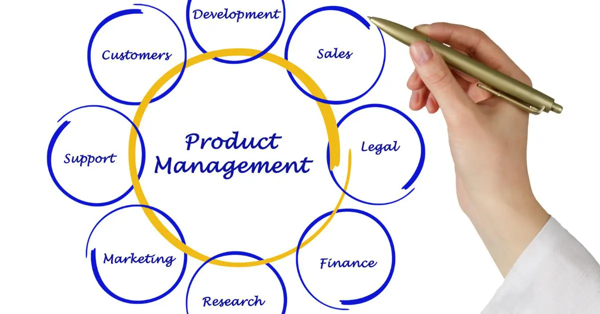
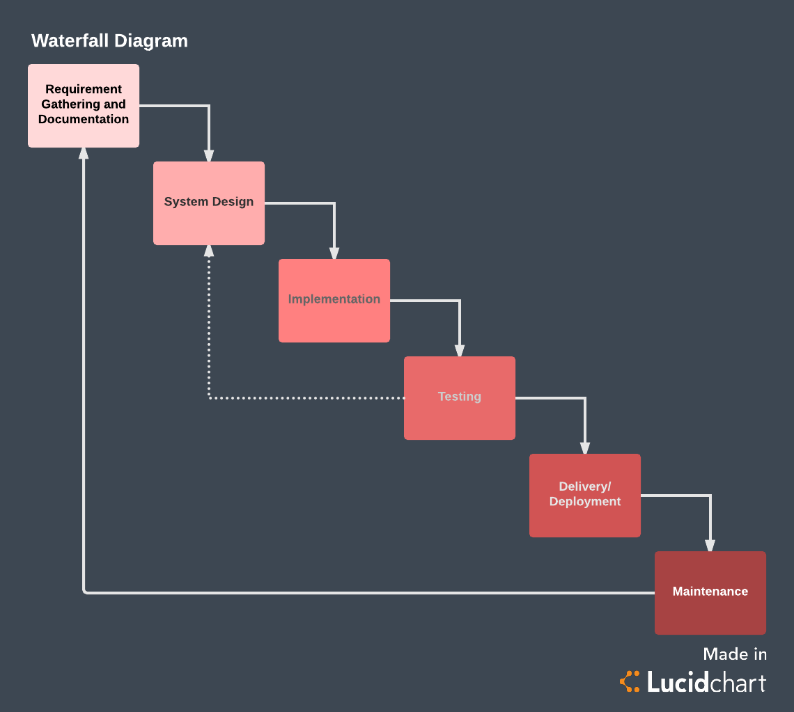
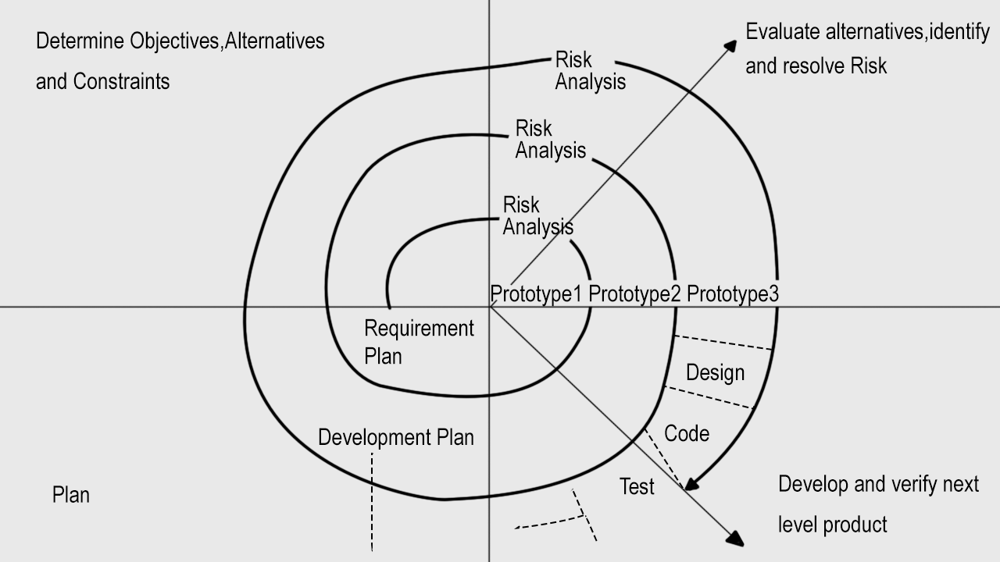
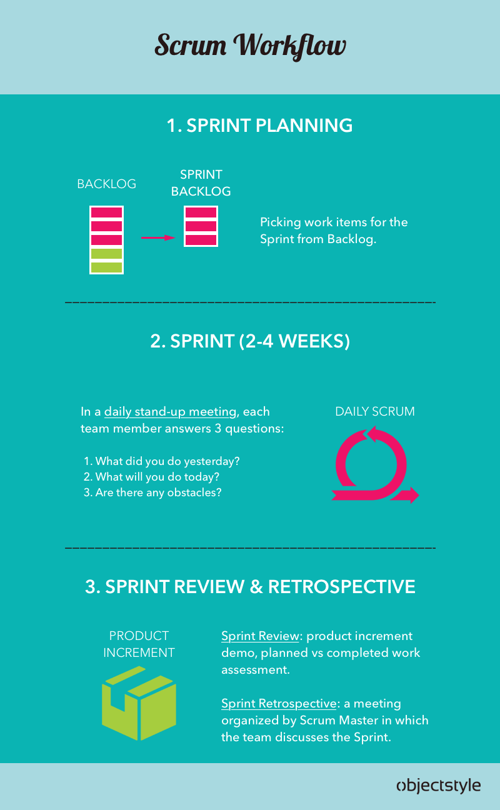

##### Previous Lesson
[Module2 Lesson3](Module2%20Lesson3.md)

# Agile Development
##### Project Management
Product Management is the art and science of building the right product for the right people. It encompasses understanding what to build, why to build it, and how to position it. Part marketer, part engineer, part sales, and part project manager, the product manager needs to understand the business, marketplace and customer to make sure they come together to form an amazing product.

- ###### Example Product Management methods
- Waterfall relies on teams following a sequence of steps and never moving forward until the previous phase has been completed
	
 Spiral

- ###### Agile Development
	-  The [Agile Manifesto](https://agilemanifesto.org/principles.html) 
	- Only work on the most important things at any given point in time
	- Break those things into small bite-sized tasks for individuals to work on autonomously    
	
	- Catch up for about 10-20 minutes every morning on progress
	-   Meet at the end of a set of 'things' to plan the next set of 'things
-  [Kanban](Sample%20Kanban.md) , Scrum, [Lean](https://en.wikipedia.org/wiki/Lean_software_development)

# Scrum Framework!

#####  Basics of Scrum
###### Steps

1.  In the [sprint planning](https://clickup.com/blog/agile/sprint-planning/) phase, teams agree on what product backlog items they want to work on. The product backlog is a list of tasks, bug fixes, user feedback that a team needs to work on to complete the project.
   
2. The team adds the product backlog items on a [Scrum board](https://clickup.com/blog/scrum-board/).(Same as KanBan board!)
   
3. Step 3: Teams host [Scrum meetings](https://clickup.com/blog/scrum-meetings/) known as daily Scrum standups, to discuss their progress and the issues they’ve faced.
   
4. Once the sprint ends, the team showcases the product to the users at the sprint review meeting.
   
5. The Scrum team then hosts a sprint retrospective, where they discuss ways to improve their next Scrum sprint performance.
   
6. The Scrum team then starts on the next sprint until the entire development process is complete!

##### Scum roles and events
- ###### Scrum Master  
	-   Ensures that the team follows the Agile principles. 
	-   Leads sprint planning and retrospectives. 
	-   Resolves any issues or impediments that arise.
- ###### Product Owner  
	**The Product Owner oversees the entire product development process. They are the voice of the customer, and their job is to ensure that the product meets the user's needs.**
	-  Act as a facilitator in sprint planning and review sessions. 
	-   Help to define sprint goals and objectives. 
	-   Lead the development of user stories and tasks. 
	-   Manage sprints and tasks to ensure on-time delivery. 
	-   Assume the role of a liaison between the team and stakeholders. 
	-   Collaborate with product owners to ensure user stories and tasks are accurate and complete. 
	-   Provide feedback and suggestions on ways to improve processes.
- ###### Development Team
**They are responsible for the implementation of the product and need to have a good understanding of the Scrum framework.**
	
-  Break down tasks
- Estimate Time
- Estimate the amount of work involved
- Implement features  

# Sprints

-   Objectives
	-   Plan a Sprint 
	-   Use a project management tool

##### Project Management tools such as
- [Notion](https://www.notion.so/)/ [Obsidian](Sample%20Kanban.md)
-  [GitHub projects](https://github.com/features/issues)
-  [Jira](https://www.atlassian.com/software/jira?&aceid=&adposition=&adgroup=136973856930&campaign=18440774103&creative=639487383004&device=c&keyword=jira&matchtype=e&network=g&placement=&ds_kids=p73335831609&ds_e=GOOGLE&ds_eid=700000001558501&ds_e1=GOOGLE&gclid=CjwKCAjw3ueiBhBmEiwA4BhspHcVcdgbpe6hmcdjF9ktkz8MegLHw2S-ofQKLaam58IqQdefAlNpvRoCddcQAvD_BwE&gclsrc=aw.ds)
-  Paper and a Board
- [ClickUP](https://app.clickup.com/9006018613/v/l/8cctw1n-30)

##### Next Lesson
[Module2 Lesson3](Module2%20Lesson7.md)
