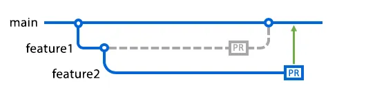

##### Previous Lesson
[Module2 Lesson3](Module3%20Lesson1.md)

# Git


Navigate

Navigate to path and create a directory (folder)
```bash

cd /path/to/your/folder
mkdir YourFolderName
```

Create a text file.
```bash
touch sampletext.txt
git init
git add  sampletext.txt
git commit sampletext.txt -m 'sample comment'
```


# GitHub (Remote)
[git](https://git-scm.com/) = version control protocol

[GitHub](https://github.com/) = most popular  remote (cloud) hosting 

[Github Desktop](https://desktop.github.com/) = GUI interface for github


- Make a blank repository in Github


```bash 
git remote add origin <origin link (HTTPS) >
git push -u origin main
```

(you may be prompted to enter your github username and password)
(you may need to setup a personal access token )
https://github.com/settings/tokens


# Intro to Collaboration

Make a new directory outside the previous one
```bash
cd
cd /path/to/your/folder
mkdir YourFolderName
```


 - Fork the repo
```bash 
git clone <project to clone link (HTTPS) >
```

##### Next Lesson
[Module2 Lesson3](Module2%20Lesson7.md)

# Sync, Fetch and Pull
- Sync within github to check for new commits

Fetch the changed to remote
```bash
git fetch
```

Pull the changes  into your local project
```bash
git pull
```


# Pull Requests
Add Some text files!

```bash
touch sampletext.txt
git add  yourname.txt
git commit -m 'added my name'
```

push your changes back up to remote
```bash
git push
```
# Merging Pull Requests

- open a pull request 


(The owner will merge it)
